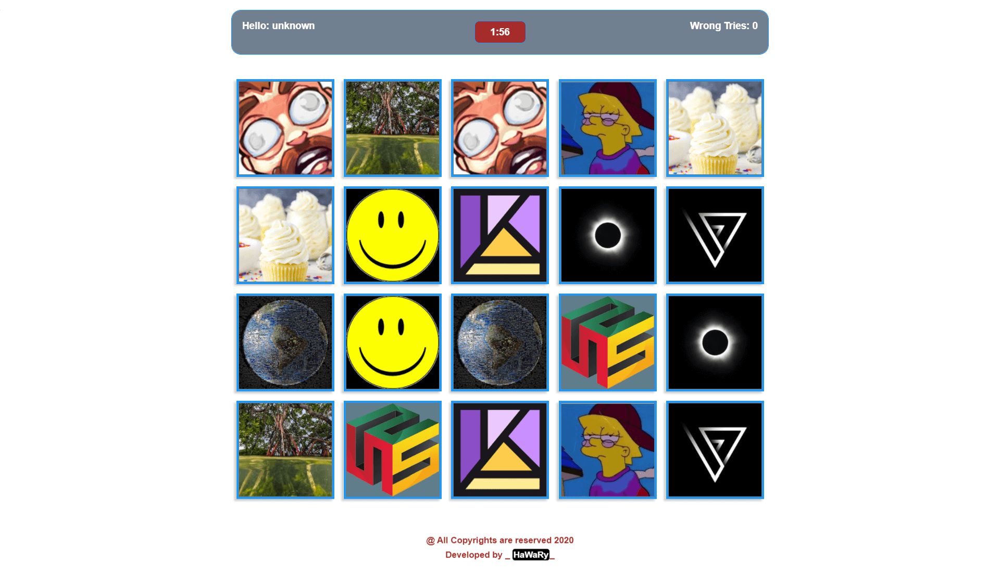

# memory-boxes  

  

Memory Boxes is a memory game App that depends on how you can match every two similar boxes together before time is gone out.

You can view the App from [here](https://memoryboxes.netlify.app/)

## Demo  

  

## Built with

* HTML
* CSS
* Vanilla JS

## Author

* [Mohamed Elhawary](https://www.linkedin.com/in/mohamed-elhawary14/) 

## Contact me through my social accounts

* Email: mohamed.k.elhawary@gmail.com
* [Linkedin](https://www.linkedin.com/in/mohamed-elhawary14/)
* [Github](https://github.com/Mohamed-Elhawary)  
* [Behance](https://www.behance.net/mohamed-elhawary14)
* [Codepen](https://codepen.io/Mohamed-ElHawary) 

## License

Licensed under the [MIT License](LICENSE)
